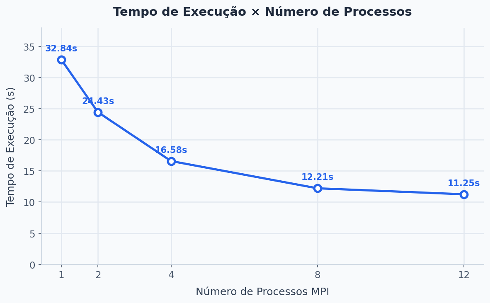
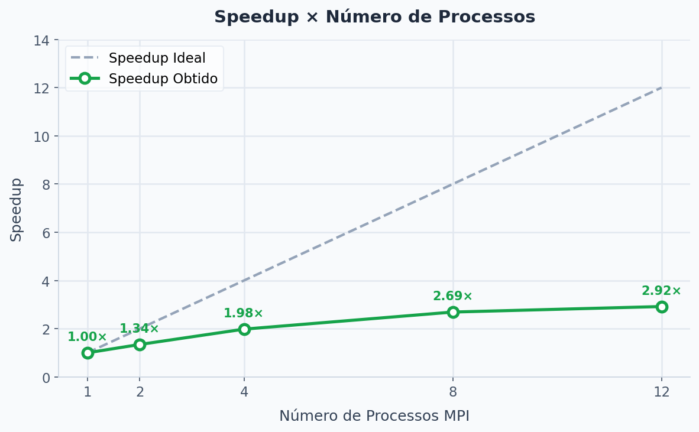
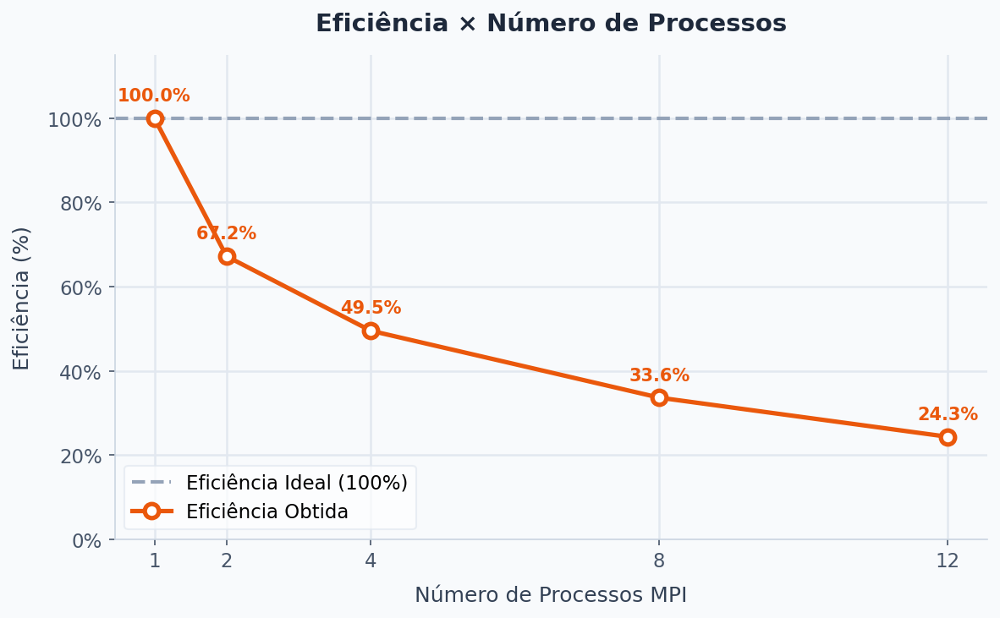

# Relatório – Avaliação de Similaridade de Perguntas com MPI

**Disciplina:** Computação Paralela e Distribuída
**Aluno(s):** Mateus Recalde da Fonseca Cotrim
**Professor:** Rafael Marconi Ramos
**Data:** 08/04/2026

---
 
# 1. Descrição do Problema
 
O programa tem como objetivo identificar os pares de perguntas mais parecidas dentro de um dataset do Quora (Quora Question Pairs). Para isso, ele compara todas as combinações possíveis de pares usando similaridade cosseno aplicada sobre vetores TF-IDF, que é uma forma de representar textos numericamente levando em conta a frequência e relevância das palavras.
 
O algoritmo percorre a metade superior de uma matriz de comparações — ou seja, todos os pares (i, j) onde i < j — para evitar comparações duplicadas. Com 5.000 perguntas, isso gera exatamente 12.497.500 comparações, o que representa um volume grande de processamento e justifica o uso de paralelismo.
 
A paralelização foi feita com MPI, dividindo as linhas `i` da matriz entre os processos disponíveis. Cada processo fica responsável por um intervalo de índices `i` e realiza todas as comparações correspondentes.
 
- **Objetivo:** retornar os 20 pares de perguntas com maior similaridade no dataset.
- **Entrada:** 5.000 perguntas → C(5000, 2) = 12.497.500 comparações.
- **Algoritmo:** similaridade cosseno sobre representações TF-IDF.
- **Complexidade:** O(n²) no número de comparações, onde n = 5.000.
- **Objetivo da paralelização:** reduzir o tempo total dividindo as comparações entre múltiplos processos MPI.
 
---
 
# 2. Ambiente Experimental
 
Os experimentos foram realizados na seguinte máquina:
 
| Item                        | Descrição                                                      |
| --------------------------- | -------------------------------------------------------------- |
| Processador                 | Intel Core i5-12500 (12ª Geração), 3,00 GHz base              |
| Número de núcleos           | 6 núcleos físicos / 12 lógicos (Hyper-Threading)              |
| Cache L1 / L2 / L3          | 480 KB / 7,5 MB / 18,0 MB                                     |
| Memória RAM                 | 16,0 GB DDR4 4800 MT/s (1 módulo DIMM, slot 1 de 2)           |
| Armazenamento               | SSD NVMe ADATA 512 GB (SM2P41C3Q), tempo de resposta 1,6 ms   |
| Sistema Operacional         | Windows 11                                                     |
| Linguagem                   | Python 3.x                                                     |
| Biblioteca MPI              | mpi4py                                                         |
| Execução                    | mpiexec                                                        |
 
---
 
# 3. Metodologia de Testes
 
O tempo de execução foi medido pelo próprio script `avaliador_mpi.py`. O processo de rank 0 é responsável por registrar o tempo total, desde o início do processamento até a consolidação dos resultados de todos os outros processos. O valor é impresso ao final no formato `Tempo total MPI: X.XX segundos`.
 
Para cada configuração foi realizada uma única execução, usando sempre as mesmas 5.000 perguntas como entrada. Os testes foram feitos numa máquina de uso pessoal, com o sistema operacional rodando normalmente — ou seja, sem isolamento de carga ou processos em segundo plano desativados. Isso pode ter introduzido alguma variação nos tempos, mas como cada configuração foi executada apenas uma vez, não foi calculada média.
 
### Configurações testadas
 
- 1 processo (execução serial, usada como base de comparação)
- 2 processos
- 4 processos
- 8 processos
- 12 processos
 
### Procedimento
 
- **Execuções por configuração:** 1 (sem cálculo de média)
- **Entrada fixa:** 5.000 perguntas — 12.497.500 comparações
- **Ambiente:** Windows 11, máquina pessoal, sem controle de carga do sistema
- **Medição:** tempo total reportado pelo processo 0 ao final de cada execução
 
---
 
# 4. Resultados Experimentais
 
A tabela abaixo apresenta os tempos de execução medidos para cada configuração:
 
| Nº Processos | Tempo de Execução (s) |
| ------------ | --------------------- |
| 1            | 32,84                 |
| 2            | 24,43                 |
| 4            | 16,58                 |
| 8            | 12,21                 |
| 12           | 11,25                 |
 
É possível observar que o tempo cai de forma significativa até 4 processos, mas os ganhos vão diminuindo a partir daí. De 8 para 12 processos a redução foi de menos de 1 segundo, o que indica que o programa está chegando perto do seu limite de escalabilidade nessa máquina.
 
---
 
# 5. Cálculo de Speedup e Eficiência
 
Para avaliar o ganho real da paralelização, foram calculados o speedup e a eficiência de cada configuração.
 
### Speedup
 
O speedup indica quantas vezes a versão paralela foi mais rápida em relação à execução serial.
 
```
Speedup(p) = T(1) / T(p)
```
 
- **T(1)** = tempo com 1 processo (serial)
- **T(p)** = tempo com p processos
 
### Eficiência
 
A eficiência mostra o quanto cada processo está sendo aproveitado de fato. Um valor de 100% significaria que todos os processos estão trabalhando o tempo todo sem desperdício.
 
```
Eficiência(p) = Speedup(p) / p
```
 
- **p** = número de processos
 
---
 
# 6. Tabela de Resultados
 
Usando T(1) = 32,84 s como referência:
 
| Processos | Tempo (s) | Speedup | Eficiência |
| --------- | --------- | ------- | ---------- |
| 1         | 32,84     | 1,00    | 100,00%    |
| 2         | 24,43     | 1,34    | 67,10%     |
| 4         | 16,58     | 1,98    | 49,50%     |
| 8         | 12,21     | 2,69    | 33,60%     |
| 12        | 11,25     | 2,92    | 24,30%     |
 
Observa-se que tanto o speedup quanto a eficiência ficaram bem abaixo do ideal em todas as configurações. O speedup ideal com 12 processos seria 12, mas o obtido foi 2,92. A eficiência caiu pela metade já com 4 processos, e chegou a menos de 25% com 12.
 
---
 
# 7. Gráfico de Tempo de Execução
 
O gráfico abaixo mostra a queda no tempo de execução conforme o número de processos aumenta. A redução mais expressiva ocorre até 4 processos, após o que a curva começa a se estabilizar.
 

 
---
 
# 8. Gráfico de Speedup
 
O gráfico compara o speedup obtido com o speedup ideal (linear). A distância entre as duas curvas evidencia o quanto a paralelização ficou abaixo do esperado.
 

 
---
 
# 9. Gráfico de Eficiência
 
O gráfico mostra a queda progressiva da eficiência conforme mais processos são adicionados. Idealmente a eficiência deveria se manter próxima de 100%, mas na prática cai bastante já nas primeiras configurações.
 

 
---
 
# 10. Análise dos Resultados
 
**O speedup foi próximo do ideal?**
 
Não. O speedup máximo obtido foi de 2,92 com 12 processos, enquanto o ideal teórico seria 12. Isso indica que a implementação atual não consegue aproveitar bem o paralelismo disponível. A diferença entre o speedup real e o ideal é causada principalmente pelo desbalanceamento de carga e pelos custos de comunicação entre os processos.
 
**A aplicação escalou bem?**
 
Parcialmente. Existe ganho de desempenho em todas as configurações testadas, mas ele vai diminuindo a cada passo. O salto mais significativo foi de 1 para 4 processos, onde o tempo caiu de 32,84 s para 16,58 s — praticamente metade. A partir de 8 processos os ganhos foram bem menores, e de 8 para 12 a diferença foi de apenas 0,96 s, o que mostra que a aplicação já estava saturada.
 
**Em que ponto a eficiência caiu mais?**
 
A eficiência já começa a cair na primeira configuração paralela: com 2 processos ela vai de 100% para 67,10%. A queda continua em todas as configurações, chegando a 24,30% com 12 processos. Isso significa que, nessa configuração, mais de 75% da capacidade dos processos está sendo desperdiçada — seja esperando outros processos terminarem, comunicando dados ou realizando trabalho redundante.
 
**O número de processos passou do número de núcleos físicos?**
 
Sim, a partir de 8 processos. A máquina tem 6 núcleos físicos e 12 lógicos via Hyper-Threading. Com 8 processos, dois deles já precisam compartilhar algum núcleo físico. Com 12, todos os processadores lógicos estão ocupados. O Hyper-Threading permite que dois processos compartilhem um núcleo, mas o desempenho não é o mesmo que ter núcleos dedicados — especialmente para cargas de processamento intenso como essa. Isso explica por que o ganho de 8 para 12 processos foi tão pequeno.
 
**Houve overhead de paralelização?**
 
Sim, e o principal problema foi o desbalanceamento de carga. O programa divide as linhas `i` de forma linear entre os processos, mas as primeiras linhas têm muito mais comparações do que as últimas — porque `j` vai de i+1 até n-1, então quanto menor o `i`, mais comparações ele gera. Com 2 processos, o Processo 0 ficou com 9.373.750 comparações enquanto o Processo 1 fez apenas 3.123.750. Como o tempo final depende do processo mais lento, o Processo 1 ficou ocioso por boa parte da execução, desperdiçando recursos.
 
Além disso, outros fatores contribuíram para a perda de desempenho:
 
- **Comunicação MPI:** ao final, cada processo envia seus top-20 pares para o processo 0 consolidar os resultados, o que gera algum custo de comunicação.
- **Carregamento redundante do dataset:** cada processo carrega e vetoriza o dataset de forma independente, sem reaproveitar o trabalho dos outros.
- **Overhead do Python:** por ser interpretado, o Python já tem um custo base maior que linguagens compiladas como C ou C++, o que amplifica qualquer ineficiência na paralelização.
 
---
 
# 11. Conclusão
 
A paralelização com MPI funcionou e trouxe ganho real de desempenho: o tempo de execução caiu de 32,84 s para 11,25 s ao ir de 1 para 12 processos, uma redução de cerca de 66%. No entanto, o speedup obtido foi de apenas 2,92×, muito abaixo do ideal teórico de 12×, o que indica que a implementação atual não aproveita bem o potencial do paralelismo disponível.
 
A configuração de 4 processos foi a que apresentou o melhor equilíbrio: speedup de ~2× com eficiência de 49,50%. Aumentar além de 4 processos trouxe ganhos decrescentes, e a partir de 8 os retornos foram praticamente marginais.
 
O maior problema identificado foi o desbalanceamento de carga na divisão das linhas entre os processos. Para melhorar os resultados, algumas mudanças seriam importantes:
 
- **Balancear a carga pelo número real de comparações**, não pelo número de linhas — isso garantiria que todos os processos terminem ao mesmo tempo.
- **Compartilhar os vetores TF-IDF entre os processos** via broadcast, evitando o reprocessamento redundante do dataset em cada um.
- **Vetorizar melhor o cálculo de similaridade** com NumPy para reduzir o overhead do interpretador Python.
- **Explorar uma abordagem híbrida MPI + threads**, que pode aproveitar melhor tanto os núcleos físicos quanto os lógicos da máquina.

 ---
